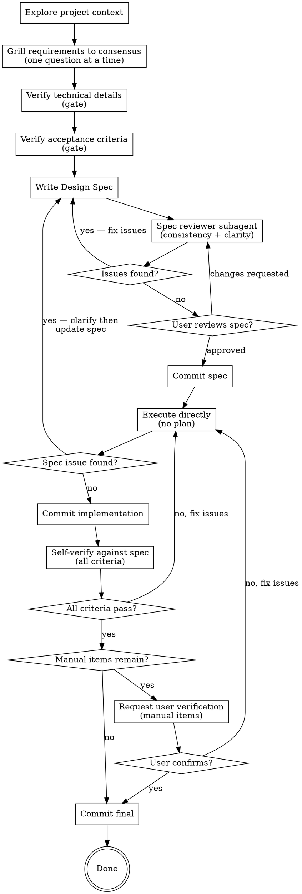

# RimWorld Modder

Consensus-driven development workflow tailored for RimWorld modding. Adds assembly reverse engineering as a standing capability for inspecting game code, mod dependencies, and Workshop mods.

<HARD-GATE>
Do NOT write any code, scaffold any project, or take any implementation action until:
1. The Design Spec is written AND
2. The user has explicitly confirmed to proceed with execution
</HARD-GATE>

<ASSEMBLY-REVERSE-ENGINEERING>
At any point in this workflow, when you need to understand code outside the project source, use a CLI .NET decompiler to inspect assemblies. Available targets:

- **RimWorld game assemblies**: `C:\Program Files (x86)\Steam\steamapps\common\RimWorld`
- **Workshop mods**: `C:\Program Files (x86)\Steam\steamapps\workshop\content\294100`
- **Project-local assembly references**: any `.dll` in or referenced by this project

If the default paths do not exist, ask the user for the correct locations.
</ASSEMBLY-REVERSE-ENGINEERING>

## Checklist

You MUST create a task for each item and complete them in order:

1. **Explore project context** — understand existing systems, patterns, and constraints from code/configs; use assembly RE when inspecting game or mod code outside the project
2. **Grill requirements to consensus** — relentless interview, one question at a time, every branch resolved
3. **Verify technical details** — explicit gate: data flow, edge cases, error handling, existing code impact
4. **Verify acceptance criteria** — explicit gate: what needs unit tests, what needs manual testing
5. **Write Design Spec** — save to `Docs/Spec/YYYY-MM-DD-<topic>-design.md`
6. **Spec review** — dispatch reviewer subagent (`references/spec-document-reviewer-prompt.md`) for consistency and clarity; fix issues inline
7. **User review & iterate** — user reviews spec; iterate until user explicitly confirms execution; **commit spec**
8. **Execute** — implement directly following the spec; no intermediate plan; **commit implementation**
9. **Self-verify** — verify every acceptance criterion against the implementation; fix and loop until clean
10. **Request user verification** — for manual-testable items, ask the user to verify; **commit final**

## Process Flow



## 1. Explore Project Context

Read code, configs, and related files. Identify:
- Which existing systems this touches
- Similar patterns already in the codebase
- Relevant configs, data models, UI components
- Constraints from existing architecture

Use parallel exploration agents for broad searches. Read the critical files yourself.

Use assembly reverse engineering when you need to understand game systems, mod APIs, or dependency behavior not visible in the project source.

Identify applicable skills: scan the available skills list and note any whose trigger conditions (file types, systems, patterns) match what this task will touch.

## 2. Grill Requirements to Consensus

Interview the user relentlessly. Walk down every branch of the decision tree, resolving dependencies one-by-one. For each question, provide your recommended answer. If a question can be answered by exploring the codebase, explore instead of asking.

Rules:
- **ONE question at a time**
- **Prefer multiple-choice questions** — use the environment's interactive question tool when options are clear
- **Provide a recommended answer** with each question
- **Explore codebase instead of asking** when the answer is there
- **No assumptions** — if unclear, ask
- Stop only when shared, unambiguous understanding is reached

Cover these areas (adapt to the task):
1. User intent and success criteria
2. Entry/exit flows — where the user starts, how they leave, reversibility
3. Core operation — select, inspect, confirm, cancel, retry, fail, complete
4. UI shape and input model (if applicable)
5. Config/data ownership — what lives in configs, what is runtime state
6. Persistence — what must be saved, reset, migrated, derived
7. Edge cases and failure modes

## 3. Verify Technical Details

Before writing the spec, present and confirm the technical picture:

- **Data flow**: what goes in, what comes out, what transforms
- **Edge cases**: empty, missing, duplicate, error, boundary conditions
- **Error handling**: what fails, how it fails, recovery paths
- **Existing code impact**: files to touch, files to leave alone
- **Dependencies**: what must exist first, what depends on this

Ask the user to confirm. Resolve any gaps before proceeding.

## 4. Verify Acceptance Criteria

Define how correctness will be proven. Present two lists and confirm with the user:

| Type | What | How to verify |
|------|------|---------------|
| Unit-testable | Behaviors with clear input/output | Run project test command |
| Manual-testable | UI, feel, integration behaviors | Human verification steps |

Success criteria: what "done" looks like for each behavior. Lock these before the spec.

## 5. Write Design Spec

Save to `Docs/Spec/YYYY-MM-DD-<topic>-design.md`.

Required sections:
```markdown
# [Feature Name] - Design Spec

## Request
[1-2 sentence restatement]

## Design Intent
[Why this design, what problem it solves]

## Current State
[Relevant code/config facts from exploration]

## Player/User Flow
[Entry → action → feedback → exit, including all states]

## UI Shape
[If applicable: screens, panels, controls, empty/disabled/locked states]

## Config/Data Model
[Configs to add/reuse, key fields, relationships, persistence]

## System Rules & Edge Cases
[Irreversible choices, unlock rules, failure/empty/locked states, boundary conditions]

## Acceptance Criteria
[Table from Step 4]

## Out of Scope
[YAGNI exclusions]

## Related Skills & Docs
[Scan available skills and include every skill whose triggers match the file types, systems, or patterns in this task. Include relevant reference documents.]
```

## 6. Spec Review

After writing the spec, dispatch a spec reviewer subagent using `references/spec-document-reviewer-prompt.md`. The reviewer checks **consistency** (internal contradictions, conflicting requirements) and **clarity** (ambiguous requirements that could lead to wrong implementation). Fix any issues found inline, then proceed to user review.

If the reviewer returns issues, fix them in the spec before presenting it to the user.

## 7. User Review & Iterate

Present the spec:
> "Spec written to `<path>`. Please review. I'll make any changes before we start execution."

Iterate on user feedback. Only proceed when the user explicitly confirms execution.

After user confirms, commit the spec:
```bash
git add Docs/Spec/<spec-file>.md
git commit -m "spec: <feature-name>"
```

## 8. Execute

Implement directly. No intermediate plan — the spec IS the plan.

- Follow existing codebase patterns
- Implement unit-testable items with unit tests
- Run project build command after code changes; project test command after config changes
- After implementation: commit all changed files with a descriptive message

### Spec Issues During Execution

The spec is a consensus artifact. If you discover problems during implementation, you MUST pause and return to consensus — never silently deviate or guess.

| Issue | Action |
|-------|--------|
| **Ambiguity** — two reasonable readings | Pause, present the ambiguity to the user with a recommended interpretation, update spec, resume |
| **Technical infeasibility** — cannot implement as written | Pause, explain the conflict, propose a concrete alternative, update spec after user confirms, resume |
| **Internal contradiction** — two spec requirements conflict | Pause, point out the conflict, recommend a resolution, update spec after user confirms, resume |
| **Better approach discovered** — a cleaner solution exists | Pause, present the finding, explain tradeoffs, update spec only after user approves, resume |

In all cases: update the spec file first, get user alignment on the change, then continue execution from where you left off.

## 9. Self-Verify

After implementation, verify every acceptance criterion from the spec against the implementation:

1. Run the full build and test suite
2. Go through each acceptance criterion in the spec and confirm it passes
3. If any criterion fails, fix the issue and re-verify from step 1
4. Loop until every criterion passes

Do NOT proceed to user verification until self-verification is clean.

## 10. Request User Verification

If the spec has manual-testable items, present the results and request user verification:

> "Self-verification complete. All automated criteria pass. Please verify the following manual items: [list]. Let me know if anything needs fixing."

If the user reports issues, return to Execute to fix them, then re-verify. Only declare done when the user confirms the manual items pass.

After user confirmation, commit any final changes and report completion.

## Key Principles

- **Consensus before code** — shared understanding gates all implementation
- **One question, one answer** — recommended answer with every question
- **Every branch resolved** — no assumptions, no skipping
- **Verification gates are blocking** — technical details and acceptance criteria locked before spec
- **Spec is the plan** — no intermediate implementation plan; own the execution decisions
- **Spec issues stop execution** — if the spec is ambiguous, infeasible, or contradictory, pause and return to consensus; never deviate silently
- **Self-verify before handoff** — verify every criterion against the implementation; fix until clean
- **YAGNI** — exclude out-of-scope features ruthlessly
